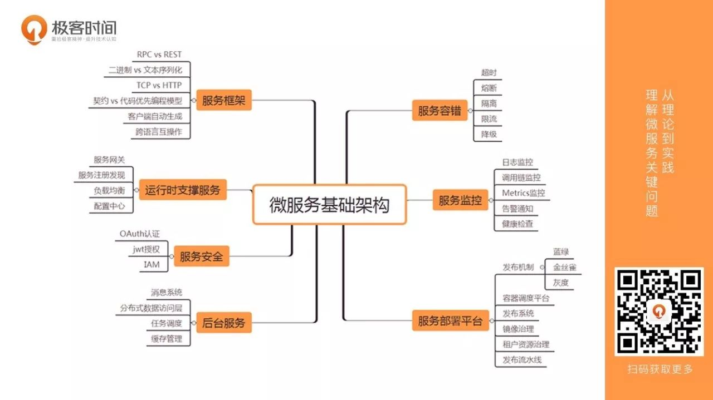

# 2018-ToDo

## Java
- Vertx
  [chinese docs](https://vertxchina.github.io/vertx-translation-chinese/)
- Summer
  [Vertx router with JAX-RS](https://github.com/yale8848/Summer)
  
## Android
- [WebView性能、体验分析与优化](https://tech.meituan.com/WebViewPerf.html)
- [如何对Android WebView 轻量缓存优化？](https://mp.weixin.qq.com/s?__biz=MzUxMzcxMzE5Ng==&mid=2247488181&amp;idx=1&amp;sn=0db95b1ad2972100d5206fedaf4cf085&source=41#wechat_redirect)
- [2017 Android插件化框架总结](http://www.360doc.com/content/17/0915/16/99071_687431479.shtml)
- [Android 热修复(全网最简单的热修复讲解)](https://www.jianshu.com/p/d17519d4952e)
## MicroService
- [Service Mesh-Next generation microservice](https://servicemesh.gitbooks.io/awesome-servicemesh/mesh/2017/service-mesh-next-generation-of-microservice/)
- [istio-An open platform to connect, manage, and secure microservices](https://github.com/istio/istio)
## AI
## Go
- [gorpool - Simple goroutine pool](https://github.com/yale8848/gorpool)
- [gosocket - Simple Golang server socket long connection skeleton](https://github.com/yale8848/gosocket)
- [docker(moby)](https://github.com/moby/moby)
- [deploy - use ssh and sftp deploy files and execute commands](https://github.com/yale8848/deploy)
- [replace - Simple replace text tool](https://github.com/yale8848/replace)
- [A Gopher - Tony Bai ](https://tonybai.com)
## BlockChain

- [理解智能合约](https://dbarobin.com/2018/01/24/blockchain-smart-contract/?hmsr=toutiao.io&utm_medium=toutiao.io&utm_source=toutiao.io)
- [IPFS——它能取代HTTP协议？](https://www.jianshu.com/p/ddccae89a49a)
- [go-libp2p](https://github.com/libp2p/go-libp2p)
- [深入浅出区块链](https://learnblockchain.cn)

## Web
- [flex.css - mobile flex pollyfill](https://github.com/lzxb/flex.css)
- [深入理解移动端像素知识与Viewport知识](https://blog.csdn.net/aiolos1111/article/details/51967744)

## Algorithm
## BigData
## Architecture
- 微服务基础架构
  
  

